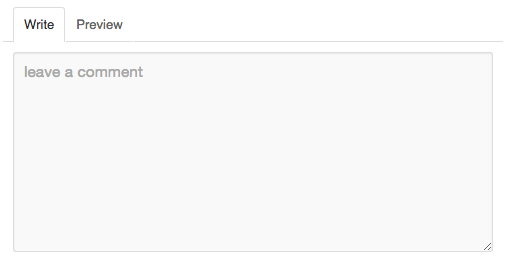

Markdown Editor
------------------------

A markdown editor integrate `write` and `preview` tabs like Github's flavored editor.



### Live Demo

[Markdown-Editor Demo](http://yorkie.ninja/markdown-editor/)

### Usage

Define your `div` element as the editor replacement.

```html
<div id="markdown-editor-sample"></div>
```

And write JavaScript:

```js
var editor = new MarkdownEditor('#markdown-editor-sample');
editor.render();
```

You can specify the width of editor by calling the `.render` function with an argument like:

```js
editor.render('auto');
// or
editor.render('500px');
```

### Install

```sh
$ npm install markdown-editor
$ bower install markdown-editor
```

### License

MIT
